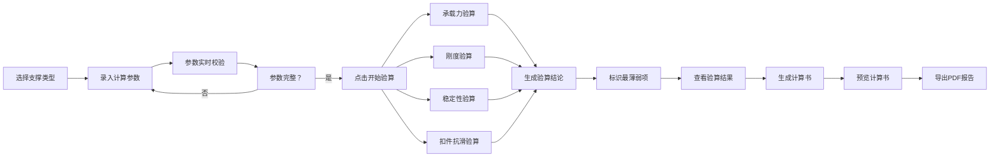

## 1. 产品概述

模板支撑安全验算Web应用是一款面向施工单位技术负责人和项目总工的专业计算工具，用于专项施工方案编制阶段对模板支撑体系进行安全性验算。系统提供梁板模板、满堂支架和扣件式钢管架三种支撑类型的自动化验算，帮助技术人员快速完成安全验算并生成可附入方案的计算书。

- 核心价值：将复杂的结构力学计算自动化，降低技术人员的计算门槛，提高方案编制效率
- 目标用户：施工单位技术负责人、项目总工、方案编制人员

## 2. 核心 Features

### 2.1 用户角色

| 角色 | 注册方式 | 核心权限 |
|------|----------|----------|
| 技术人员 | 无需注册，直接使用 | 录入参数、执行验算、查看结果、导出报告 |

### 2.2 Feature Module

1. **参数录入页**：支撑类型选择、参数表单、参数校验提示、项目信息录入
2. **验算结果页**：承载力验算、刚度验算、稳定性验算、扣件抗滑验算、最薄弱项标识
3. **报告导出页**：计算书预览、参数汇总、验算过程摘要、整改建议、PDF导出

### 2.3 Page Details

| 页面名称 | 模块名称 | 功能描述 |
|----------|----------|----------|
| 参数录入页 | 支撑类型选择 | 梁板模板/满堂支架/扣件式钢管架三种类型切换 |
| 参数录入页 | 参数表单 | 层高、板厚、梁截面、立杆间距、步距、木方规格、钢管型号、施工荷载等参数录入 |
| 参数录入页 | 参数校验 | 实时检测参数完整性，表格形式提示缺失参数及超出常用取值范围的参数 |
| 参数录入页 | 项目信息 | 项目名称、编制人、编制日期等基础信息录入 |
| 验算结果页 | 承载力验算 | 抗弯强度、抗剪强度验算，显示通过/不通过结论 |
| 验算结果页 | 刚度验算 | 挠度验算，显示通过/不通过结论 |
| 验算结果页 | 稳定性验算 | 立杆稳定性验算，显示通过/不通过结论 |
| 验算结果页 | 扣件抗滑验算 | 扣件抗滑承载力验算，显示通过/不通过结论 |
| 验算结果页 | 最薄弱项 | 高亮显示所有验算项目中安全储备最小的项 |
| 报告导出页 | 计算书预览 | 完整计算书内容预览，包含输入参数、验算过程、结论 |
| 报告导出页 | 整改建议 | 根据验算结果给出针对性的整改建议 |
| 报告导出页 | 报告导出 | 支持PDF格式导出，可直接附入施工方案 |

## 3. 核心流程

用户首先进入参数录入页面，选择支撑类型（梁板模板、满堂支架或扣件式钢管架），然后按照图纸逐项录入各项参数。系统实时校验参数，以表格形式提示哪些参数缺失或超出常用取值范围。参数录入完成后，用户点击"开始验算"按钮，系统自动进行承载力、刚度、稳定性和扣件抗滑等项目的验算，跳转到验算结果页，展示各项验算的通过/不通过结论，并标出最薄弱项。用户确认验算结果后，可进入报告导出页，预览完整的计算书内容，包含输入参数、验算过程摘要、整改建议和项目名称，最后导出PDF文件附入施工方案。

## 4. User Interface Design

### 4.1 设计风格

- 主色调：专业深蓝（#1e3a5f），体现工程领域的专业严谨
- 辅助色：警示橙（#f59e0b）用于参数警告，成功绿（#10b981）用于通过项，危险红（#ef4444）用于不通过项
- 按钮风格：直角矩形，2px边框，点击有轻微下沉效果，体现工业感
- 字体：标题使用"思源黑体 Bold"，正文使用"思源黑体 Regular"，等宽字体用于数值显示
- 布局风格：卡片式布局，清晰的功能分区，左侧导航+右侧内容区
- 图标风格：线性图标，统一2px线宽，避免花哨装饰

### 4.2 页面设计概述

| 页面名称 | 模块名称 | UI Elements |
|----------|----------|-------------|
| 参数录入页 | 类型选择 | 卡片式选项，选中状态有蓝色边框高亮，悬停有阴影效果 |
| 参数录入页 | 参数表单 | 分组折叠面板，每组参数有独立的校验状态指示，输入框右侧显示单位 |
| 参数录入页 | 参数校验表 | 固定在页面右侧的悬浮面板，实时更新参数状态，缺失项标红，超范围项标橙 |
| 验算结果页 | 验算项目卡片 | 四象限网格布局，每个卡片显示验算项目名称、计算值、允许值、结论徽章 |
| 验算结果页 | 最薄弱项 | 顶部醒目标识条，红色背景，闪烁动画效果，突出显示 |
| 报告导出页 | 计算书预览 | A4纸尺寸模拟，白底黑字，标准公文格式，分页显示 |
| 报告导出页 | 导出按钮 | 固定在页面底部的操作栏，包含重新验算和导出PDF两个主要按钮 |

### 4.3 响应式

- 采用桌面优先设计，针对1920×1080及以上分辨率优化
- 平板设备：自适应布局，参数校验表改为底部显示
- 移动设备：单列布局，折叠面板默认收起，简化操作流程

