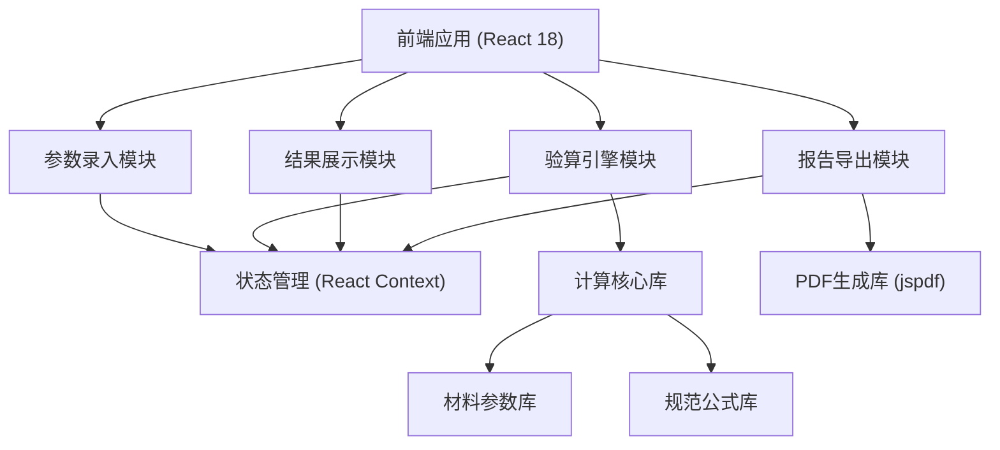
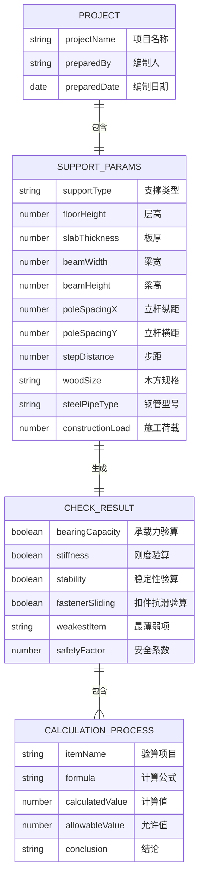

## 1. 架构设计



## 2. 技术描述

- **前端框架**: React@18 + TypeScript + Vite@5
- **样式方案**: TailwindCSS@3 + CSS变量主题系统
- **路由管理**: React Router DOM@6
- **状态管理**: React Context API + useReducer
- **图标库**: Lucide React
- **PDF导出**: jspdf + html2canvas
- **表单校验**: 自定义校验hooks
- **初始化工具**: Vite create-vite
- **后端**: 纯前端应用，无后端服务
- **数据库**: LocalStorage 本地存储计算历史

## 3. 路由定义

| 路由 | 用途 |
|-------|---------|
| / | 参数录入页 |
| /result | 验算结果页 |
| /report | 报告导出页 |

## 4. 数据模型

### 4.1 数据模型定义



### 4.2 TypeScript 类型定义

```typescript
// 支撑类型
export type SupportType = 'slab' | 'fullSupport' | 'fastenerFrame';

// 项目信息
export interface ProjectInfo {
  projectName: string;
  preparedBy: string;
  preparedDate: string;
}

// 支撑参数
export interface SupportParams {
  supportType: SupportType;
  floorHeight: number;
  slabThickness: number;
  beamWidth: number;
  beamHeight: number;
  poleSpacingX: number;
  poleSpacingY: number;
  stepDistance: number;
  woodSize: string;
  steelPipeType: string;
  constructionLoad: number;
}

// 参数校验结果
export interface ValidationResult {
  field: string;
  label: string;
  status: 'valid' | 'missing' | 'outOfRange';
  value: number | string;
  min?: number;
  max?: number;
  unit: string;
}

// 单项验算结果
export interface CheckItemResult {
  name: string;
  calculatedValue: number;
  allowableValue: number;
  unit: string;
  passed: boolean;
  formula: string;
  process: string;
}

// 综合验算结果
export interface CalculationResult {
  bearingCapacity: CheckItemResult;
  bendingStrength: CheckItemResult;
  shearStrength: CheckItemResult;
  stiffness: CheckItemResult;
  stability: CheckItemResult;
  fastenerSliding: CheckItemResult;
  weakestItem: string;
  weakestSafetyRatio: number;
  overallPassed: boolean;
}

// 整改建议
export interface Suggestion {
  item: string;
  problem: string;
  suggestion: string;
  priority: 'high' | 'medium' | 'low';
}

// 计算书数据
export interface CalculationReport {
  projectInfo: ProjectInfo;
  params: SupportParams;
  result: CalculationResult;
  suggestions: Suggestion[];
  generatedAt: string;
}
```

## 5. 核心模块说明

### 5.1 验算引擎模块

核心计算逻辑，基于《建筑施工模板安全技术规范》(JGJ162-2008) 和 《建筑施工扣件式钢管脚手架安全技术规范》(JGJ130-2011) 实现：

- **承载力验算**：包括抗弯强度计算和抗剪强度计算
- **刚度验算**：挠度计算，限值为L/250或L/400
- **稳定性验算**：立杆稳定系数计算，长细比控制
- **扣件抗滑验算**：扣件抗滑承载力设计值取8kN

### 5.2 材料参数库

内置常用材料参数：

| 材料类型 | 规格 | 弹性模量(N/mm²) | 抗弯强度设计值(N/mm²) | 抗剪强度设计值(N/mm²) |
|----------|------|----------------|----------------------|----------------------|
| 木方 | 50×100 | 9000 | 13 | 1.4 |
| 木方 | 60×80 | 9000 | 13 | 1.4 |
| 钢管 | φ48×3.0 | 2.06×10⁵ | 205 | 120 |
| 钢管 | φ48×3.5 | 2.06×10⁵ | 205 | 120 |

### 5.3 参数常用取值范围

| 参数 | 常用范围 | 单位 |
|------|----------|------|
| 层高 | 2.8 ~ 6.0 | m |
| 板厚 | 100 ~ 300 | mm |
| 梁宽 | 200 ~ 600 | mm |
| 梁高 | 400 ~ 1200 | mm |
| 立杆纵距 | 0.8 ~ 1.5 | m |
| 立杆横距 | 0.8 ~ 1.2 | m |
| 步距 | 1.2 ~ 1.8 | m |
| 施工荷载 | 1.0 ~ 3.0 | kN/m² |

